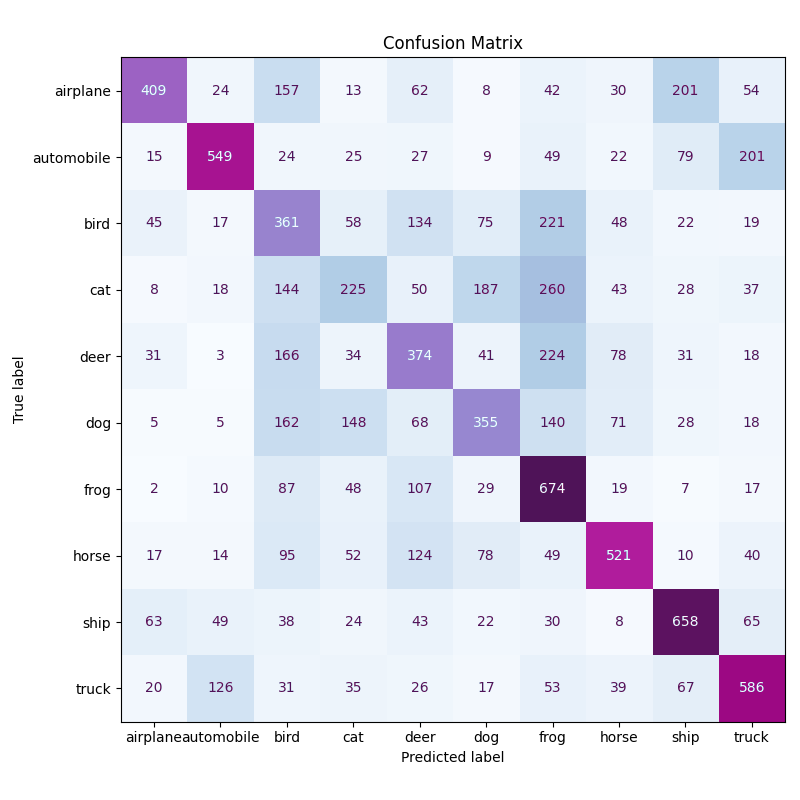

# Задание 1: Сравнение CNN и полносвязных сетей (40 баллов)
## 1.1 Сравнение на MNIST (20 баллов)
Сравните производительность на MNIST:
- Полносвязная сеть (3-4 слоя)
- Простая CNN (2-3 conv слоя)
- CNN с Residual Block

Для каждого варианта:
- Обучите модель с одинаковыми гиперпараметрами\
batch_size: 128\
epochs: 10\
optimizer: Adam\
learning_rate: default Adam (обычно 0.001)\
loss_function: CrossEntropyLoss\
device: cuda (если доступна), иначе cpu\
Архитектуры моделей:\
FCNet: 4 слоя, размеры: 28×28 -> 512 -> 256 -> 128 -> 10\
SimpleCNN: 3 свёрточных слоя с MaxPooling, полносвязные слои 128 -> 10\
ResNetLike: 1 свёрточный слой + 2 residual блока, adaptive avg pooling, fc 128 -> 10
- Сравните точность на train и test множествах
```
Точность на train множестве:
FCNet      train acc: 0.9900   test acc: 0.9842
SimpleCNN  train acc: 0.9933   test acc: 0.9911
ResNetLike train acc: 0.9972   test acc: 0.9903
```

- Измерьте время обучения и инференса
```
Время обучения (сек):
FCNet: 122.46
SimpleCNN: 421.26
ResNetLike: 886.66

Время инференса (сек):
FCNet: 0.003
SimpleCNN: 0.02
ResNetLike: 0.04
```
- Визуализируйте кривые обучения

**Test accuracy**


**Train accuracy**


- Проанализируйте количество параметров
```
Сравнение числа параметров:
FCNet: 567434           # Самая большая модель по количеству параметров из-за крупных полносвязных слоев (512, 256, 128)
SimpleCNN: 241546       # Меньше параметров, так как сверточные слои используют локальные связи и параметр sharing
ResNetLike: 290058      # Немного больше параметров, чем SimpleCNN, за счет residual блоков и batch normalization; архитектура глубже и эффективнее
```

## 1.2 Сравнение на CIFAR-10 (20 баллов)
Сравните производительность на CIFAR-10:
- Полносвязная сеть (глубокая)
- CNN с Residual блоками
- CNN с регуляризацией и Residual блоками

Для каждого варианта:
- Обучите модель с одинаковыми гиперпараметрами\
batch_size: 128\
epochs: 10\
optimizer: Adam или SGD (momentum=0.9)\
learning_rate: 0.001 (Adam) или 0.1 (SGD, с понижением по эпохам)\
weight_decay: 1e-4 (для ResNet, регуляризация)\
dropout: 0.3–0.5 (для FCNet и регуляризованной CNN)\
augmentation: случайные сдвиги, горизонтальные отражения\
loss: CrossEntropyLoss

- Сравните точность и время обучения
```
DeepFCNet              train acc: 0.4353 test acc: 0.4781 time (s): 1078.26
ResNetCIFAR            train acc: 0.9105 test acc: 0.8273 time (s): 1754.79
ResNetCIFARRegularized train acc: 0.7711 test acc: 0.7934 time (s): 129482
```
- Проанализируйте переобучение\
ResNetCIFAR демонстрирует явные признаки переобучения: высокая точность и низкие потери на обучении, но заметно худшие результаты на тесте, особенно по мере увеличения эпох.\
Регуляризация в ResNetCIFARRegularized помогает уменьшить переобучение.\
DeepFCNet не переобучается, но и не имеет высокой точности.
- Визуализируйте confusion matrix

**DeepFCNet**


**ResNetCIFAR**


**ResNetCIFARRegularized**


- Исследуйте градиенты (gradient flow)\
Сеть имеет стандартное поведение градиентна для глубоких моделей: градиенты затухают по мере продвижения к более глубоким слоям, но не исчезают => механизм обратного распространения ошибки работает исправно, отсутствие критических проблем с обучаемостью. Регуляризация влияет на равномерное распределение градиентов

# Задание 2: Анализ архитектур CNN (30 баллов)
## 2.1 Влияние размера ядра свертки (15 баллов)
Исследуйте влияние размера ядра свертки:
- 3x3 ядра
- 5x5 ядра
- 7x7 ядра
- Комбинация разных размеров (1x1 + 3x3)

Для каждого варианта:
- Поддерживайте одинаковое количество параметров
```
Сравнение числа параметров:
CNN_3x3: 20042
CNN_5x5: 19922
CNN_7x7: 18782
CNN_Combo: 19274
```
- Сравните точность и время обучения
```
CNN_3x3    train acc: 0.5342   test acc: 0.5345   time (s): 876.87
CNN_5x5    train acc: 0.5652   test acc: 0.5513   time (s): 877.32
CNN_7x7    train acc: 0.5360   test acc: 0.5345   time (s): 882.96
CNN_Combo  train acc: 0.4545   test acc: 0.4387   time (s): 870.72
```
- Проанализируйте рецептивные поля\
Размер рецептивного поля напрямую зависит от размера фильтра.\
Малые рецептивные поля (3×3) — для выделения локальных деталей и текстур.\
Большие рецептивные поля (5×5, 7×7) — эффективны для захвата общих особенностей и контуров.\
Грамотное совместное использование фильтров разных размеров позволяет сети быть чувствительной к признакам всех масштабов.

- Визуализируйте активации первого слоя

**3x3**


**5x5**


**7x7**


**1x1 + 3x3**


## 2.2 Влияние глубины CNN (15 баллов)
Исследуйте влияние глубины CNN:
- Неглубокая CNN (2 conv слоя)
- Средняя CNN (4 conv слоя)
- Глубокая CNN (6+ conv слоев)
- CNN с Residual связями

Для каждого варианта:
- Сравните точность и время обучения
```
ShallowCNN     train acc: 0.4709   test acc: 0.4608   time (s): 1209.43
MediumCNN      train acc: 0.6180   test acc: 0.6093   time (s): 5000.82
DeepCNN        train acc: 0.6776   test acc: 0.6872   time (s): 9499.45
ResidualCNN    train acc: 0.8504   test acc: 0.7883   time (s): 17119.74
```
- Проанализируйте vanishing/exploding gradients\
Затухание градиентов присутствует: чем глубже слой, тем меньше средний градиент, особенно в ResidualCNN, но residual-связи эффективно предотвращают полное исчезновение градиентов. В ShallowCNN затухание выражено сильнее между сверточными слоями, но не критично. Это может замедлять обучение начальных слоёв, особенно в очень глубоких сетях.\
Взрыва градиентов не обнаружено: все значения находятся в разумных пределах, что говорит о корректной инициализации весов и адекватной архитектуре.\
Стабильность: такая картина градиентного потока считается нормальной для современных сверточных сетей, особенно если используются методы вроде ReLU, BatchNorm и хорошая инициализация. Остаточные связи в ResidualCNN выполняют свою функцию, обеспечивая стабильное обучение даже в глубокой сети. В неглубокой ShallowCNN затухание незначительно и не мешает обучению.

- Исследуйте эффективность Residual связей\
Residual-связи радикально повышают эффективность обучения глубоких сверточных сетей: ускоряют рост точности, обеспечивают более быстрое снижение ошибки и предотвращают затухание градиентов. Это позволяет ResidualCNN превосходить классические архитектуры по всем ключевым метрикам на обучающей выборке.

- Визуализируйте feature maps

**ShallowCNN**


**MediumCNN**


**DeepCNN**


**ResidualCNN**


# Задание 3: Кастомные слои и эксперименты (30 баллов)
## 3.1 Реализация кастомных слоев (15 баллов)
Реализуйте кастомные слои:
- Кастомный сверточный слой с дополнительной логикой
- Attention механизм для CNN
- Кастомная функция активации
- Кастомный pooling слой

Для каждого слоя:
- Реализуйте forward и backward проходы\
- Добавьте параметры если необходимо\
- Протестируйте на простых примерах
```
Результаты для 5 эпох:
Время обучения: 144.42
train_acc: 0.8582
test_acc:  0.8876
```
- Сравните с стандартными аналогами
```
SimpleCNN:          train_acc: 0.9948   test_acc: 0.9880   time (s): 196.89
CNNWithCustomLayers train_acc: 0.8872   test_acc: 0.8962   time (s): 301.20
FCNet:              train_acc: 0.9954   test_acc: 0.9806   time (s): 122.46
```

## 3.2 Эксперименты с Residual блоками (15 баллов)
Исследуйте различные варианты Residual блоков:
- Базовый Residual блок
- Bottleneck Residual блок
- Wide Residual блок

Для каждого варианта:
- Реализуйте блок с нуля\
- Сравните производительность
```
Время обучения (с):
BasicResNet:        884.32
BottleneckResNet:   874.83
WideResNet:         903.63
```
- Проанализируйте количество параметров
```
Сравнение числа параметров:
BasicResNet:        304810
BottleneckResNet:    33770
WideResNet:         886762
```
BottleneckResNet — самая компактная модель.\
BasicResNet — среднее между размером и качеством.\
WideResNet — самая "тяжёлая" и потенциально самая точная, но требует больше ресурсов.\
Честное сравнение: Bottleneck-блоки дают сильную экономию параметров, Wide-блоки — максимальное качество за счёт увеличения числа каналов.

- Исследуйте стабильность обучения\
Все три модели обучаются стабильно: нет резких скачков.\
WideResNet — самая устойчивая и эффективная по качеству обучения из трёх.\
BottleneckResNet требует дополнительной настройки или глубины, чтобы достичь такой же стабильности и качества, как остальные.\

